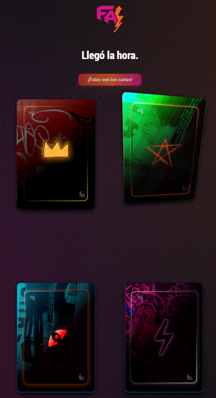

# Factor Aleatorio - Cartas Holográficas CSS

Este proyecto es una exploración interactiva y visual basada en efectos holográficos avanzados implementados en CSS y SvelteJS.

> [!NOTE]
> **Filosofía del proyecto:**
> Nacidos del azar y con un propósito en común: aventurarnos en lo improbable y encontrar lo extraordinario.
> Sabemos que hay un tesoro escondido detrás de cada obviedad. Y no solo uno. Puede haber tantos como posibilidades nos regale el azar.

---

### Una colección de estilos CSS avanzados aplicados con SvelteJS.
Usa transformaciones 3D, gradientes, modos de mezcla (blend-modes) y filtros en CSS para simular efectos holográficos realistas sobre cartas coleccionables.

---

> Fork and inspiration [Pokemon Cards](https://github.com/simeydotme/pokemon-cards-css/issues/19) 

---
#### attribution

- Galaxy Holo from [aschefield101](https://www.deviantart.com/aschefield101/art/HoloSheet-2012-313543843)  
- Some backgrounds from [Vecteezy](https://www.vecteezy.com/free-photos)
